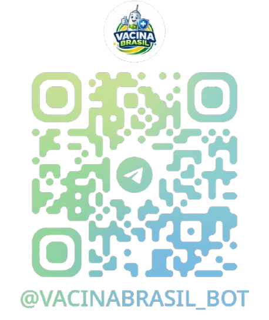

# Aprendizado por Projeto Integrado (API) - Vacina Brasil Bot 💉

<p align="center">
  
</p>

Assistente virtual para Telegram que informa vacinas recomendadas com base na faixa etária.

Projeto desenvolvido durante o **1º semestre de 2026** por estudantes do curso de **Análise e Desenvolvimento de Sistemas da FATEC São José dos Campos**.

O projeto segue a metodologia ágil **Scrum**, com foco em desenvolvimento colaborativo e organização de tarefas.

## 🎥 Demonstração

<p align="center">
  <a href="TROCAR_PELO_NOVO_LINK">
    
  </a>
</p>

## 📑 Índice

* [🎥 Demonstração](#-demonstração)
* [🎯 Objetivo do Projeto](#-objetivo-do-projeto)
* [👥 Equipe](#-equipe)
* [🎓 Orientadores](#-orientadores)
* [📋 Requisitos Não Funcionais](#-requisitos-não-funcionais)
* [🧰 Tecnologias Utilizadas](#-tecnologias-utilizadas)
* [🏗 Estrutura do Projeto](#-estrutura-do-projeto)
* [📌 Product Backlog](#-product-backlog)
* [📊 Registro das Sprints](#-registro-das-sprints)
* [📖 Manual do Usuário](#-manual-do-usuário)
* [🛠️ Manual de Instalação](#manual-instalacao)

## 🎯 Objetivo do Projeto

Desenvolver um assistente virtual para Telegram que utilize dados de portais públicos oficiais de saúde sobre vacinação para informar o cidadão sobre:

* Calendário vacinal para diferentes faixas etárias (crianças, adultos e idosos);
* Consulta de vacinas recomendadas para gestantes de acordo com a semana de gestação.

Não deve haver persistência dos dados através de bancos de dados.

## 👥 Equipe

| Nome                   | Função        | LinkedIn & GitHub                                                                                              |
| :--------------------- | :-----------: | :-----------------------------------------------------------------------------------------------------------: |
| Nicolas Fonseca Meira   | Scrum Master | [](https://www.linkedin.com/in/nicolas-fonseca-60386130b/) [](https://github.com/NicolasFonsecaM) |
| Caio Gabriel Ferreira de Paula |  Product Owner | [](https://www.linkedin.com/in/) [](https://github.com/caiogabrielfp-cpu) |
| Gabriel Yudi Fujimoto  | Scrum Team    | [](https://www.linkedin.com/in/gabriel-fujimoto-a90239367/) [](https://github.com/fujimotogabriel) |
| Miguel Silva Gomes     | Scrum Team    | [](https://www.linkedin.com/in/miguelsg479/) [](https://github.com/miguelsg97) |

## 🎓 Orientadores

- Prof. Jean Carlos Lourenço Costa
- Prof. Giuliano Araújo Bertoti

## 📋 Requisitos Não Funcionais

* Linguagem de Programação Python;
* Repositório Git;
* Manual do Usuário;
* Gestão de Projetos de Software com Jira;
* Manual de Instalação.

## 🧰 Tecnologias Utilizadas

<h4 align="center">
  <a href="https://www.python.org/">
    
  </a>
  <a href="https://telegram.org/">
    
  </a>
  <a href="https://git-scm.com/">
    
  </a>
  <a href="https://github.com/">
    
  </a>
  <br>
  <a href="https://code.visualstudio.com/">
    
  </a>
  <a href="https://www.atlassian.com/software/jira">
    
  </a>
</h4>

## 🏗 Estrutura do Projeto

* `src/main.py` — Inicia o bot e controla o funcionamento dele no Telegram;

* `src/data_handler/scraping.py` — extrai e processa os dados de vacinação a partir dos calendários oficiais disponíveis do site do Ministério da Saúde;

* `src/data_handler/scraping_update.py` — atualiza os dados extraídos pelo arquivo `scraping.py` semanalmente para entregar os dados mais recentes ao usuário;

* `src/data_handler/loader.py` — Carrega e prepara os dados utilizados pelo sistema;

* `src/core/engine.py` — Processa as informações fornecidas pelo usuário e determina quais respostas são apropriadas;

* `src/utils/helpers.py` — Funções auxiliares utilizadas em diferentes partes do projeto;

* `src/data/processed/` — diretório onde os arquivos JSON são armazenados;

* `requirements.txt` — Lista de bibliotecas Python necessárias para executar o projeto.

## 📌 Product Backlog

| Rank | Prioridade | User Story | Sprint |
| :--- | :---: | :--- | :---: |
| 1 | Alta | Como usuário, quero acessar o bot pelo Telegram para iniciar a consulta de informações sobre vacinação. | 1 |
| 2 | Alta | Como usuário, quero selecionar minha faixa etária para receber as vacinas recomendadas. | 1 |
| 3 | Alta | Como usuário, quero utilizar um menu interativo com botões para navegar pelas opções do sistema. | 1 |
| 4 | Alta | Como equipe de desenvolvimento, precisamos estruturar o repositório Git e organizar as tarefas no Jira para gerenciar o desenvolvimento do projeto. | 1 |
| 5 | Alta | Como usuário, quero melhorar a navegação pelo menu interativo com botões para tornar a experiência mais intuitiva. | 2 |
| 6 | Alta | Como usuário, quero consultar a cobertura vacinal por região para obter informações atualizadas. | 2 |
| 7 | Alta | Como equipe de desenvolvimento, queremos corrigir erros identificados durante a validação do sistema para garantir respostas corretas. | 2 |

## 📊 Registro das Sprints

| Sprint            | Previsão   | Status         | Histórico |
|-------------------|------------|----------------|-----------|
| 01                | 05/04/2026 | Concluída ✅   | [MVP](MVP/sp1.md) |
| 02                | 03/05/2026 | Concluída ✅    | [MVP](MVP/sp2.md) |

## 📖 Manual do Usuário

### 1. Apresentação

O bot de vacinação (`@vacinabrasil_bot`) é um assistente no Telegram que permite consultar rapidamente quais vacinas são recomendadas de acordo com a **faixa etária selecionada pelo usuário**.

A interação ocorre diretamente pelo chat do Telegram, onde o usuário seleciona opções ou informa dados básicos, e o sistema retorna as vacinas recomendadas para aquele perfil. A base de dados utilizada pelo bot é composta por arquivos JSON gerados a partir de calendários de vacinação disponibilizados como arquivos PDF pelo Ministério da Saúde em `https://www.gov.br/saude/pt-br/vacinacao/calendario`.

---

### 2. Público-alvo e Dores Atendidas 👤🩺

#### Usuários atendidos

* **Responsáveis por crianças:** Pais ou responsáveis que desejam acompanhar as vacinas recomendadas para seus filhos.
* **Jovens e adultos:** Pessoas que querem verificar quais vacinas ou reforços são indicados para sua faixa etária.
* **Idosos:** Usuários que desejam consultar quais imunizações são recomendadas a partir dos 60 anos.
* **Gestantes:** Mulheres que precisam saber quais vacinas são indicadas durante o período de gestação.

#### Dores que o bot atende

* **Dificuldade de interpretação do calendário vacinal:** As tabelas oficiais possuem muitas informações. O bot simplifica e mostra apenas as vacinas relevantes para o usuário.
* **Acesso rápido à informação:** Em vez de navegar por páginas e documentos, o usuário pode consultar as vacinas diretamente no Telegram.
* **Informação específica para gestantes:** O bot permite consultar rapidamente as vacinas recomendadas de acordo com a faixa etária de interesse do usuário.
* **Consulta de cobertura vacinal:** O usuário consegue consultar, através da navegação por botões, as coberturas vacinais de diversas regiões do Brasil.

---

### 3. Iniciando o Bot

1. Abra o **Telegram**
2. Procure pelo bot `@vacinabrasil_bot` ou leia o QR Code abaixo:

<p align="center">
  
</p>

3. Abra a conversa e digite `/start` ou envie uma mensagem qualquer

Após a execução dessa etapa, o bot iniciará a interação e exibirá as opções disponíveis.

---

### 4. Fluxo principal de uso

#### 4.1 Menu inicial

Após enviada a primeira mensagem, o bot responderá com a mensagem:

**Escolha sua opção:**

e exibirá as seguintes opções:

* `Gestante 🤰`
* `Criança 👶`
* `Jovens 🧑`
* `Adulto 🧑‍💼`
* `Idoso 👴`

#### 4.2 Consulta por faixa etária/grupo

1. Clique em uma **faixa etária** ou em **Gestante 🤰**
2. O bot exibirá as vacinas recomendadas para as pessoas que se encaixam na faixa etária escolhida.

Exemplo de resposta:

```
9 a 14 anos
HPV4
    - 1 dose (conforme histórico vacinal)

10 a 14 anos
dengue tetravalente
    - 2 doses (conforme histórico vacinal)

11 a 14 anos
meningite meningocócica ACWY
    - 1 dose

10 a 24 anos
hepatite B
    - 3 doses (conforme histórico vacinal)
dT
    - 3 doses (conforme histórico vacinal)
febre amarela
    - 1 dose (conforme histórico vacinal)
tríplice viral SCR
    - 2 doses (conforme histórico vacinal)
pneumocócica 23 – valente
    - 2 doses (somente indígena, sem histórico vacinal com pneumo conjugada)
varicela
    - 2 doses (somente indígena e trabalhador de saúde, sem histórico da doença ou na dúvida e conforme histórico vacinal)
```

#### 4.3 Consulta por nome da vacina

Além das consultas a partir dos botões, o bot também permite buscar informações específicas sobre uma vacina pelo nome.

Para isso, utilize o comando:

```
/procurar <nome_da_vacina>
```

Exemplo de uso:

```
/procurar dT
```

Como funciona:

Ao enviar o comando, o bot realiza uma busca na base de dados e retorna informações a respeito da faixa etária/grupo que deve tomar a vacina informada.

Exemplo de resposta:

```
Agendar ao saber da gravidez
dT
    - 3 doses (conforme histórico vacinal)

A partir de 7 anos (todas as idades)
dT
    - 3 doses (conforme histórico vacinal)

10 a 24 anos
dT
    - 3 doses (conforme histórico vacinal)
```

---

### 5. Respostas do sistema

Após a consulta, o bot retorna uma lista com as vacinas recomendadas e suas respectivas doses.

Exemplo:

```
Agendar ao saber da gravidez
hepatite B
    - 3 doses (conforme histórico vacinal)
dT
    - 3 doses (conforme histórico vacinal)
influenza trivalente
    - 1 dose por temporada
covid-19
    - 1 dose a cada gestação
dTpa
    - 1 dose a partir da 20ª semana gestacional, em cada gestação
febre amarela 1
    - 1 dose, em casos excepcionais, conforme histórico vacinal
vírus sincicial respiratório (VVSR)
    - 1 dose a partir da 28ª semana gestacional, em cada gestação
```

As informações são apresentadas de forma direta, indicando o **nome da vacina** e a **dose ou periodicidade recomendada**.

---

### 6. Observações

* O bot precisa estar **em execução** para responder às mensagens.
* O usuário pode iniciar a conversa a partir do envio do comando `/procurar`.
* O tempo de resposta pode levar alguns segundos enquanto o sistema processa os dados.

---

### 7. Exemplo de uso

Digite:

```
/start
```
ou envie uma mensagem qualquer.

Selecione uma das **faixas etárias ou grupos disponíveis** clicando em um dos botões.

Após a seleção de uma faixa etária/grupo, o bot exibirá as vacinas recomendadas para o grupo escolhido pelo usuário.

Exemplo de saída:

```
Agendar ao saber da gravidez
hepatite B
    - 3 doses (conforme histórico vacinal)
dT
    - 3 doses (conforme histórico vacinal)
influenza trivalente
    - 1 dose por temporada
covid-19
    - 1 dose a cada gestação
dTpa
    - 1 dose a partir da 20ª semana gestacional, em cada gestação
febre amarela 1
    - 1 dose, em casos excepcionais, conforme histórico vacinal
vírus sincicial respiratório (VVSR)
    - 1 dose a partir da 28ª semana gestacional, em cada gestação
```

## 🛠️ Manual de Instalação <a id="manual-instalacao"></a>

Para instalar e executar o bot de maneira local:

### 1.1 Requisitos

Para executar o bot localmente é necessário:

* Conexão à Internet;
* [Python](https://www.python.org/downloads/) 3.9 ou superior instalado;
* [Git](https://git-scm.com/install/);
* Token de um bot criado no **BotFather (@BotFather no Telegram)**;

### 1.2 Instalação

Abra um terminal e clone o repositório:

```bash
git clone https://github.com/nexusdevapi/VacinaBrasil-Bot.git
cd VacinaBrasil-Bot
```

Instale as dependências:

```bash
python -m pip install -r requirements.txt
```

### 1.3 Inserindo um Token

Abra o arquivo `main.py` localizado na pasta `src` na raiz do projeto e insira um **token gerado pelo BotFather** no seguinte espaço:

```bash
TOKEN = ""
```

`(Exemplo de Token: "7391826405:AAQxZr7KpLmN8sVtY2HdFJcW9uB3EgR5iKQ")`

### 1.4 Executando o Bot

Dentro do diretório gerado, execute:

```bash
python src/main.py
```

Agora é só iniciar uma conversa com o bot no Telegram e manter-se em dia!
